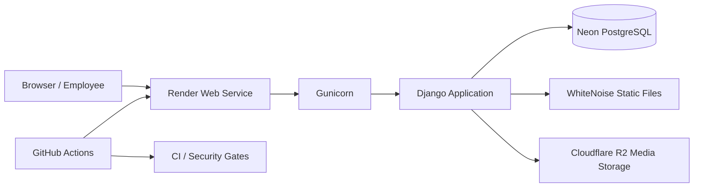

# OYERA Auto Service System

[](https://github.com/moaz-alnor/oyera-auto-service-system/actions/workflows/ci.yml)
[](https://github.com/moaz-alnor/oyera-auto-service-system/actions/workflows/codeql.yml)
[](https://github.com/moaz-alnor/oyera-auto-service-system/actions/workflows/container.yml)


A production-oriented records and workshop management platform for **Oyera Auto Service Bay Ltd (OAS Bay)**. OYERA brings customer, vehicle, quotation, job-card, workshop, inventory, purchasing, billing, reporting, and role-based operational workflows into one Django application.

**Live deployment:** [oyera-auto-service-system.onrender.com](https://oyera-auto-service-system.onrender.com/)

> The live deployment is an operational environment. Public demonstration credentials are intentionally not published here.

## Overview

OYERA was built to replace fragmented workshop records with a single auditable workflow. The application supports the complete service lifecycle from customer intake and vehicle registration through quotation, workshop execution, stock movement, invoicing, payment, reporting, and vehicle release.

The project includes:

- production-ready Django configuration;
- PostgreSQL persistence;
- role-based access control using Django groups and permissions;
- operational health checks;
- hardened Gunicorn runtime;
- WhiteNoise static-file delivery;
- Render deployment support;
- Neon PostgreSQL support;
- Cloudflare R2-compatible media storage;
- Docker-based production deployment as an alternative runtime;
- automated CI, dependency auditing, Bandit, CodeQL, and Dependabot;
- database backup and protected restore tooling;
- role-by-role browser UAT with preserved evidence and handover documentation.

## Key capabilities

| Area | Capabilities |
| --- | --- |
| Accounts & access | Employee accounts, roles, permissions, authentication |
| Customers | Customer records, activation/deactivation, contact information |
| Vehicles | Vehicle records, ownership history, ownership transfer |
| Quotations | Service/product quotations, revision, submission, approval/rejection |
| Job cards | Workshop job lifecycle, inspection, notes, cancellation, vehicle release |
| Workshop | Work orders, technician assignments, task lifecycle, technical notes |
| Inventory | Items, locations, reservations, issues, returns, stock movements |
| Product catalogue | Products, categories, price history, activation/deactivation |
| Service catalogue | Services, applicability, price history |
| Purchasing | Suppliers, purchase orders, receipts, supplier invoices and payments |
| Billing | Customer invoices, payments, voiding and payment status |
| Reports | Customer finance, workshop operations, inventory and purchasing reports |
| Auditability | User-attributed actions, controlled state transitions, UAT evidence |

## User roles

| Role | Primary responsibility |
| --- | --- |
| Administrator | System administration and unrestricted operational oversight |
| Manager | Operational approvals, reporting and management actions |
| Receptionist | Customer, vehicle, quotation and front-desk workflows |
| Senior Technician | Workshop oversight plus controlled inventory actions |
| Technician | Assigned workshop tasks and technical updates |
| Cashier | Customer and supplier payment workflows |

Permissions are assigned through Django groups. Normal employees should receive one operational group and should not be given superuser access.

## Architecture



See [docs/ARCHITECTURE.md](docs/ARCHITECTURE.md).

## Technology stack

| Layer | Technology |
| --- | --- |
| Application | Python 3.13, Django 5.2 |
| Database | PostgreSQL |
| Production server | Gunicorn |
| Static files | WhiteNoise |
| Cloud web runtime | Render |
| Managed database | Neon |
| Object storage | Cloudflare R2 / S3-compatible storage |
| Container runtime | Docker / Docker Compose |
| Reverse proxy option | Caddy |
| Testing | pytest, pytest-django |
| Code quality | Ruff |
| Security | Bandit, pip-audit, CodeQL, Dependabot |
| CI/CD | GitHub Actions |

## Repository layout

```text
.
├── .github/
├── deploy/
├── docs/
├── requirements/
├── scripts/
├── src/
│   ├── apps/
│   ├── config/
│   └── manage.py
├── tests/
├── Dockerfile
├── compose.production.yml
├── gunicorn.conf.py
├── render.yaml
└── pyproject.toml
```

## Local development

### Prerequisites

- Python 3.13
- PostgreSQL
- Git

### Setup

```bash
git clone https://github.com/moaz-alnor/oyera-auto-service-system.git
cd oyera-auto-service-system

python3.13 -m venv .venv
source .venv/bin/activate

python -m pip install --upgrade pip
python -m pip install -r requirements/development.txt

cp .env.example .env
```

Configure PostgreSQL in `.env`, then run:

```bash
python src/manage.py migrate
python src/manage.py seed_roles
python src/manage.py createsuperuser
python src/manage.py runserver
```

Open `http://127.0.0.1:8000/`.

For more detail, see [docs/DEVELOPMENT.md](docs/DEVELOPMENT.md).

## Quality gates

The CI workflow validates dependency health, vulnerability auditing, Bandit, Ruff, migration drift, PostgreSQL migrations, Django checks, and the complete automated test suite.

```bash
ruff check src tests scripts gunicorn.conf.py
ruff format --check src tests scripts gunicorn.conf.py
python src/manage.py makemigrations --check --dry-run
python src/manage.py check
pytest
```

## User acceptance testing

The final handover package records:

- **32/32 role-based UAT cases passed**;
- **41 screenshot evidence files**;
- **10 CSV evidence files**;
- a complete tester guide;
- separate guides for all six operational roles.

See [docs/handover/README.md](docs/handover/README.md).

## Deployment

### Managed cloud deployment

The repository supports Render for Django, Neon for PostgreSQL, and Cloudflare R2 for S3-compatible persistent media storage. See [`render.yaml`](render.yaml).

### Container deployment

The repository also retains a production container deployment for VPS/container environments:

- [`Dockerfile`](Dockerfile)
- [`compose.production.yml`](compose.production.yml)
- [`docs/operations/production-deployment.md`](docs/operations/production-deployment.md)

## Security

Security measures include environment-controlled secrets, HTTPS-aware production settings, HSTS support, role-based authorization, dependency auditing, Bandit, CodeQL, Dependabot, secret scanning, and protected database restore workflows.

Never commit `.env` files, database URLs, Render secrets, Neon passwords, R2 keys, or production credentials.

Vulnerabilities should be reported privately according to [SECURITY.md](SECURITY.md).

## Documentation

| Document | Purpose |
| --- | --- |
| [Architecture](docs/ARCHITECTURE.md) | Components, boundaries and data flow |
| [Development guide](docs/DEVELOPMENT.md) | Local setup and engineering workflow |
| [Handover package](docs/handover/README.md) | UAT evidence and role guides |
| [Production deployment](docs/operations/production-deployment.md) | Production container operations |
| [Database backup/restore](docs/operations/database-backup-restore.md) | Database protection and recovery |
| [Security policy](SECURITY.md) | Private vulnerability reporting |
| [Contributing](CONTRIBUTING.md) | Contribution and review standards |
| [Support](SUPPORT.md) | Support routes |
| [Changelog](CHANGELOG.md) | Significant project changes |

## Contributing

See [CONTRIBUTING.md](CONTRIBUTING.md). Changes should be developed on focused branches, tested locally, reviewed through pull requests, and merged only after required checks pass.

## License

This repository does not currently publish an open-source license. Unless a license is added, reuse, modification, or redistribution should not be assumed to be permitted.

## Maintainer

Maintained by [@moaz-alnor](https://github.com/moaz-alnor).
