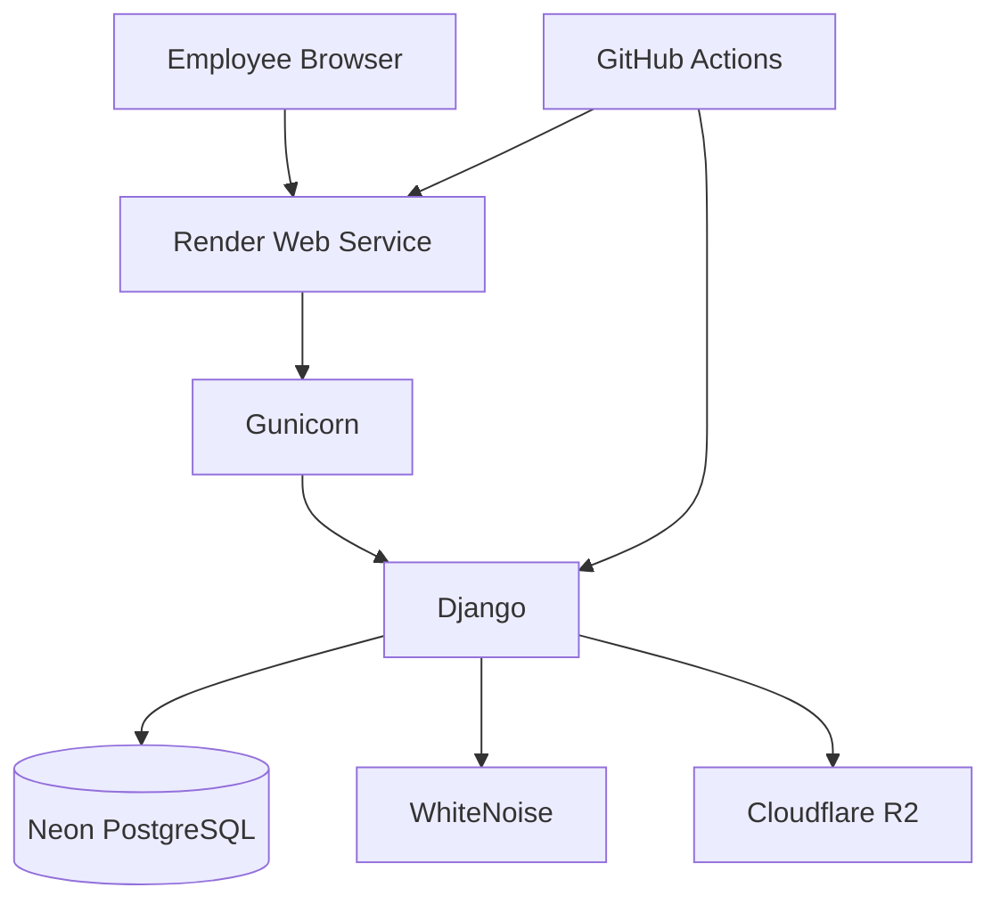

# OYERA Architecture

OYERA is a modular Django application for managing the operational lifecycle of an automotive service workshop.

## High-level architecture

## Domain applications

| Application | Responsibility |
| --- | --- |
| `accounts` | Employee identity, roles, permissions and authentication |
| `core` | Shared behavior, errors and health checks |
| `customers` | Customer records and lifecycle |
| `vehicles` | Vehicle records and ownership |
| `quotations` | Customer quotations and approval workflow |
| `jobs` | Job cards, inspections, notes and vehicle release |
| `workshop` | Work orders, assignments, tasks and technical notes |
| `inventory` | Stock items, reservations and movements |
| `product_catalogue` | Product master data and pricing |
| `service_catalogue` | Service master data and pricing |
| `purchasing` | Suppliers, purchase orders, receipts and supplier finance |
| `billing` | Customer invoices and payments |
| `reports` | Operational and financial reporting |

## Runtime

Render runs Django behind Gunicorn. Production accepts a `DATABASE_URL` for Neon while preserving split `POSTGRES_*` settings for the Docker deployment. WhiteNoise serves static files. S3-compatible Cloudflare R2 storage is enabled when `USE_R2_STORAGE=true`.

## Authentication and authorization

Authentication uses the custom Django user model. Authorization uses Django groups and managed permissions for Administrator, Manager, Receptionist, Senior Technician, Technician, and Cashier.

## Health checks

- `/health/live/` verifies that the web process is alive.
- `/health/ready/` verifies readiness including database access.

## CI/CD

GitHub Actions validates quality, security, migrations, Django checks, and tests. Render deployment is defined in `render.yaml` and tracks `main`.

## Alternative deployment

The repository retains a Docker/Caddy/PostgreSQL deployment path. See [operations/production-deployment.md](operations/production-deployment.md).

## Acceptance evidence

UAT artifacts and handover material are preserved under `docs/uat/` and `docs/handover/`.
